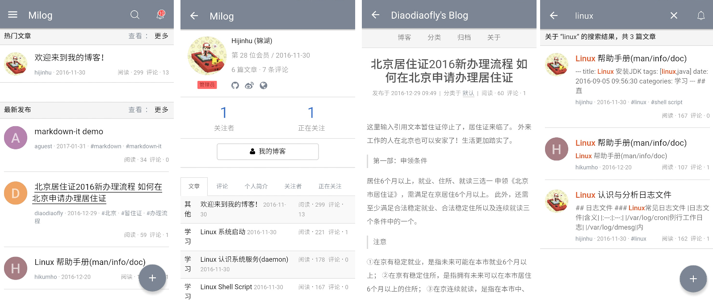

# SprachSpiel for Android
This project was forked from Milog Android client. 

SprachSpiel Android app is based on [TurbolinksAndroid Library](https://github.com/turbolinks/turbolinks-android), it is a native android app that includes an Android WebView. The native components includes an [Android Navigation Drawer](https://developer.android.com/reference/android/support/v4/widget/DrawerLayout.html), a Toolbar, Notifications, Turbolinks-Android WebView..etc...

The backend is based on Rails 5 [SprachSpiel App](https://github.com/fabriziobertoglio1987/sprachspiel)

I suggest to read the commit history, the comments of my and the other projects, also extensively read the Turbolinks and Turbolinks-Android documentation and do a basic Android Sdk training.

## Thanks

+ [Milog Android](https://github.com/HiKumho/milog-android)

+ [Turbolinks Android](https://github.com/turbolinks/turbolinks-android)

+ [ruby-china-android](https://github.com/ruby-china/ruby-china-android)

## Development

+ Git pull code to the local

+ modify the `HOST_URL` in `Constants.java` with the same ip of your computer. You can find out the ip from the output of `ifconfig` in your terminal and start your `rails server` with command `rails s -b 192.1.1.32 -p 3000`.
This command will start the puma webserver at http://192.1.1.32:3000

## Pictures of the Original Milog App
I forked this projects from Milog Android, soon I will upload my own pictures

